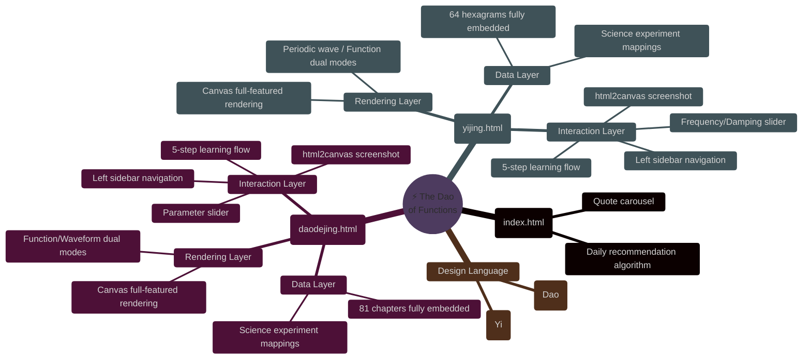

<div align="center">

# ⚡ Observe · Symbolize · Enact · Dao

### The Dao De Jing × I Ching × Mathematical Functions × Modern Scientific Experiments

[](README-EN.md)
[](README.md)
[](https://github.com/)
[](https://github.com/)
[](https://github.com/)
[](https://github.com/)

**If Laozi and Leibniz sat down for tea, they would certainly use calculus to discuss the Dao.**

</div>

---

## 🧠 Origin of Inspiration · The Cognitive Evolution Panorama

This project did not begin with the intention of "building a tool." It originated from an interdisciplinary intuition:  
**The texts of the *Dao De Jing* and the *I Ching* are, in essence, "textual functions" describing the laws of nature.**

The following three diagrams document the complete trajectory of this project, from the initial spark of inspiration to the final engineering delivery, as well as the division of labor between human and AI.

---

### 🌌 Figure 1: Human-AI Collaboration · Cognitive Evolution Panorama (Macro Narrative)

> This diagram illustrates the complete evolutionary path of the project: from raw perception, to core decision-making, to engineering implementation, and finally to the deliverable.  
> **Recommended Use**: Interview opening statement / Overall project introduction.

```mermaid
%%{init: {'theme': 'dark', 'themeVariables': {
  'background': '#0a080c',
  'primaryColor': '#b8860b',
  'primaryBorderColor': '#b8860b',
  'primaryTextColor': '#d4c0a8',
  'secondaryColor': '#1a1420',
  'tertiaryColor': '#0e0b10',
  'lineColor': '#3a2a30',
  'fontFamily': 'Georgia, serif'
}}}%%
graph TB
    classDef human fill:#1a1420,stroke:#b8860b,stroke-width:2px,color:#d4c0a8;
    classDef ai fill:#0e0b10,stroke:#3b5e6b,stroke-width:2px,color:#8ab0b8;
    classDef output fill:#0a080c,stroke:#b8860b,stroke-width:2px,color:#b89a7a,stroke-dasharray:5 2;
    classDef decision fill:#2a1a22,stroke:#b8860b,stroke-width:1.5px,color:#e8d4b8;

    subgraph 人类层[🧠 Human · Architect · Inspiration & Decisions]
        H1["📜 Reading Dao De Jing<br>felt 'Dao' was like a function"]:::human
        H2["🔄 Reading I Ching<br>felt 'Change' was like a waveform"]:::human
        H3["🔬 Wanted to explain<br>ancient wisdom with modern science"]:::human
        H4["🧩 Core Decisions:<br>81 Chapters→13 Functions / 64 Hexagrams→6 Waveforms<br>Science Experiments per Chapter / 5-Step Learning Flow"]:::decision
        H5["🎨 Aesthetic & Product Definition:<br>Dark Purple-Gold / Dual-Mode Adaptive<br>Particle Glow / Screenshot Sharing"]:::decision
    end

    subgraph AI层[⚡ AI · Execution Engine · Translation & Iteration]
        A1["Receives fuzzy instructions<br>(e.g., draw a convergence function)"]:::ai
        A2["Retrieves & combines knowledge<br>(Math + Physics + Canvas Rendering)"]:::ai
        A3["Generates prototype code<br>(Glow curves / Particle systems / Adaptive layout)"]:::ai
        A4["Iterates based on feedback<br>(Add viewports / Adjust colors / Tweak parameters)"]:::ai
    end

    subgraph 产物层[📦 Co-created Output · Final Deliverable]
        O1["☯ 81 Chapters of Dao De Jing<br>fully embedded data"]:::output
        O2["🔄 64 Hexagrams of I Ching<br>fully embedded data"]:::output
        O3["🧪 145+ Scientific Experiment<br>metaphor cards"]:::output
        O4["⚡ Interdisciplinary Visualization Engine<br>Interactive / Screenshotable / Adaptive"]:::output
    end

    H1 --> A1
    H2 --> A1
    H3 --> A2
    A1 --> A2
    A2 --> A3
    A3 --> H4
    H4 --> A4
    A4 --> H5
    H5 --> O1 & O2 & O3 & O4
    A4 --> O1 & O2 & O3 & O4

    style 人类层 fill:#0a080c,stroke:#b8860b,stroke-width:1px
    style AI层 fill:#0a080c,stroke:#3b5e6b,stroke-width:1px
    style 产物层 fill:#0a080c,stroke:#b8860b,stroke-width:1px
```



---

### 🧩 Figure 2: Inspiration → Abstraction → Implementation (Logical Breakdown)

> This diagram focuses on "how I gradually transformed a fuzzy idea into a clear plan" — from the initial intuition of reading the classics, to the four core decisions, to the specific engineering choices.  
> **Recommended Use**: Deep-dive into project background / Demonstrate product thinking.

```mermaid
%%{init: {'theme': 'dark', 'themeVariables': {
  'background': '#0a080c',
  'primaryColor': '#b8860b',
  'primaryBorderColor': '#b8860b',
  'primaryTextColor': '#d4c0a8',
  'secondaryColor': '#1a1420',
  'tertiaryColor': '#0e0b10',
  'lineColor': '#3a2a30'
}}}%%
graph LR
    classDef idea fill:#1a1420,stroke:#b8860b,stroke-width:2px,color:#d4c0a8;
    classDef decision fill:#2a1a22,stroke:#b8860b,stroke-width:2px,color:#e8d4b8;
    classDef tech fill:#0e0b10,stroke:#3b5e6b,stroke-width:2px,color:#8ab0b8;
    classDef output fill:#0a080c,stroke:#b8860b,stroke-width:2px,color:#b89a7a,stroke-dasharray:5 2;

    subgraph 灵感层[💡 Primordial Chaos · Raw Perception]
        A1["📜 Reading Dao De Jing<br>felt 'Dao' was like a function"]:::idea
        A2["🔄 Reading I Ching<br>felt 'Change' was like a waveform"]:::idea
        A3["🔬 Wanted to explain ancient<br>wisdom with modern science"]:::idea
    end

    subgraph 抽象层[🧩 Return to Source · Core Decisions]
        B1["📐 81 Chapters → 13 Functions"]:::decision
        B2["〰️ 64 Hexagrams → 6 Waveforms"]:::decision
        B3["⚗️ Science experiment per chapter"]:::decision
        B4["🧘 Design 5-step learning flow"]:::decision
    end

    subgraph 落地层[⚙️ Inquiry into Things · Engineering Forging]
        C1["📦 Data-Driven<br>JS object embedded"]:::tech
        C2["🎨 Canvas Glow Engine<br>Particles + Tracer"]:::tech
        C3["🎛️ Slider parameter tuning<br>Screenshot sharing"]:::tech
        C4["📱 Dual-mode adaptive<br>AB testing mindset"]:::tech
    end

    subgraph 成果层[✨ Dao Realized · Final Output]
        D1["☯ 81 Chapters Dao De Jing"]:::output
        D2["🔄 64 Hexagrams I Ching"]:::output
        D3["🧪 145+ Science Experiments"]:::output
        D4["⚡ Interdisciplinary Visualization Engine"]:::output
    end

    A1 --> B1
    A2 --> B2
    A3 --> B3
    B1 --> C1
    B2 --> C1
    B3 --> C2 & C3
    B4 --> C3 & C4
    C1 & C2 & C3 & C4 --> D1 & D2 & D3 & D4

    style 灵感层 fill:#0a080c,stroke:#b8860b,stroke-width:1px
    style 抽象层 fill:#0a080c,stroke:#8a5a3b,stroke-width:1px
    style 落地层 fill:#0a080c,stroke:#3b5e6b,stroke-width:1px
    style 成果层 fill:#0a080c,stroke:#b89a7a,stroke-width:1px
```



---

### ⚡ Figure 3: Human-AI Collaborative Workflow (Division of Labor Interface)

> This diagram shows the division of labor between me and the AI throughout the project: I was responsible for inspiration, decisions, and aesthetics; the AI was responsible for translation, generation, and iteration.  
> **Recommended Use**: Demonstrate the paradigm of working with AI in the modern era / Answer the question "Did you write this code yourself?"

```mermaid
%%{init: {'theme': 'dark', 'themeVariables': {
  'background': '#0a080c',
  'primaryColor': '#b8860b',
  'primaryBorderColor': '#b8860b',
  'primaryTextColor': '#d4c0a8',
  'secondaryColor': '#1a1420',
  'tertiaryColor': '#0e0b10',
  'lineColor': '#3a2a30'
}}}%%
graph LR
    classDef human fill:#1a1420,stroke:#b8860b,stroke-width:2px,color:#d4c0a8;
    classDef ai fill:#0e0b10,stroke:#3b5e6b,stroke-width:2px,color:#8ab0b8;
    classDef output fill:#0a080c,stroke:#b8860b,stroke-width:2px,color:#b89a7a;

    subgraph 你的大脑[🧠 Human · Architect]
        H1[Fuzzy inspiration<br>(Dao is like a function)]:::human --> H2[Decision-making<br>(Define 13 mappings)]:::human
        H2 --> H3[Requirements breakdown<br>(Viewport, particles)]:::human
        H3 --> H4[Aesthetic/Product definition<br>(Dark purple-gold, 5-step flow)]:::human
    end

    subgraph AI助手[⚡ AI · Execution Engine]
        A1[Receives fuzzy instructions]:::ai --> A2[Retrieves/Combines knowledge<br>(Math+Physics+Canvas)]:::ai
        A2 --> A3[Generates prototype code]:::ai
        A3 --> A4[Iterates based on feedback]:::ai
    end

    subgraph 产物[📦 Co-created Output]
        O1[Runable HTML]:::output
        O2[Structured data<br>(81 Chapters + 64 Hexagrams)]:::output
        O3[Visualization Engine<br>(Glow + Particles + Adaptive)]:::output
    end

    H1 --> A1
    A3 --> H3
    H3 --> A4
    A4 --> H2 & H4
    H4 --> O1 & O2 & O3
    A4 --> O1 & O2 & O3

    style 你的大脑 fill:#0a080c,stroke:#b8860b,stroke-width:1px
    style AI助手 fill:#0a080c,stroke:#3b5e6b,stroke-width:1px
    style 产物 fill:#0a080c,stroke:#b8860b,stroke-width:1px
```

---

## 📊 Project Data Overview

| Dimension | Quantity | Coverage Areas |
| :--- | :--- | :--- |
| **Dao De Jing** | **81 Chapters** | Convergence · Linear · Exponential · Logarithmic · Gaussian · Quadratic · Sigmoid |
| **I Ching** | **64 Hexagrams** | Sine · Cosine · Damped · Sawtooth · Square · Triangle |
| **Science Metaphors** | **145+ Experiments** | ⚛️ Quantum Physics · 🔥 Thermodynamics · 🧬 Biology · 🧠 Psychology · 🧪 Chemistry · 🌍 Geology |
| **Interaction** | **5-Step Learning Flow** | Observe → Read → Enact → Realize → Inquire |

---

## 🧭 Core Concept: Using Function Curves to "Read" the Classics

```mermaid
%%{init: {'theme': 'dark', 'themeVariables': {
  'background': '#0a080c',
  'primaryColor': '#b8860b',
  'primaryBorderColor': '#b8860b',
  'primaryTextColor': '#d4c0a8',
  'secondaryColor': '#1a1420',
  'tertiaryColor': '#0e0b10',
  'lineColor': '#3a2a30',
  'fontFamily': 'Georgia, serif'
}}}%%
graph TB
    classDef classic fill:#1a1420,stroke:#b8860b,stroke-width:2px,color:#d4c0a8;
    classDef math fill:#0e0b10,stroke:#3b5e6b,stroke-width:2px,color:#8ab0b8;
    classDef science fill:#0a080c,stroke:#5a8a5a,stroke-width:2px,color:#8aaa8a;

    subgraph 经典文本[📜 Eastern Classics]
        DDJ(Dao De Jing 81 Chapters):::classic
        YJ(I Ching 64 Hexagrams):::classic
    end

    subgraph 函数映射[📐 Mathematical Function Mapping]
        F1(Convergence / Linear / Exponential):::math
        F2(Gaussian / Quadratic / Sigmoid):::math
        F3(Sine / Cosine / Damped):::math
        F4(Sawtooth / Square / Triangle):::math
    end

    subgraph 格物实证[🔬 Modern Scientific Experiments]
        S1(⚛️ Quantum Mechanics / Vacuum Energy):::science
        S2(🔥 Entropy / Chemical Equilibrium):::science
        S3(🧬 Population Ecology / DNA):::science
        S4(🧠 Cognitive Psychology / Weber's Law):::science
        S5(🌍 Geomechanics / Fluid Dynamics):::science
    end

    DDJ --> F1 & F2
    YJ --> F3 & F4
    F1 & F2 --> S1 & S2 & S4
    F3 & F4 --> S3 & S5

    style 经典文本 fill:#0a080c,stroke:#b8860b,stroke-width:1px
    style 函数映射 fill:#0a080c,stroke:#3b5e6b,stroke-width:1px
    style 格物实证 fill:#0a080c,stroke:#5a8a5a,stroke-width:1px
```



---

## 🎮 Interaction: 5-Step Immersive Study Flow

| Step | Action | Effect |
| :--- | :--- | :--- |
| **1️⃣ Observe** | Observe the curve/waveform | Visually intuit the form of "Dao" (convergence, oscillation, explosion) |
| **2️⃣ Read** | Read the original text | Return to the text and grasp the sage's original meaning |
| **3️⃣ Enact** | Drag the slider to adjust parameters | **Change the function parameters yourself** and see how the curve shifts with "intention" |
| **4️⃣ Realize** | Generate and share a screenshot | Save the current card as a high-res image and capture your "moment of insight" |
| **5️⃣ Inquire** | Scientific experiment as evidence | **Use physics/chemistry/biology** to explain why Laozi / King Wen was right |

---

## 🔥 Featured Mappings: Making the Abstract "Visible"

| Classic Quote | Mathematical Function | Modern Scientific Experiment | Interactive Experience |
| :--- | :--- | :--- | :--- |
| **The Dao that can be told is not the eternal Dao** | Gaussian Distribution (Probability Cloud) | ⚛️ Double-slit interference · Quantum collapse | Observation collapses the wavefunction |
| **The highest good is like water** | Damped Oscillation | 💧 Laminar vs Turbulent Flow (Reynolds Experiment) | Adjust damping to feel "non-contention" |
| **A tree that can fill your arms grows from a tiny sprout** | Exponential Function (eˣ) | 🧬 Bacterial culture · J-shaped growth | Drag slider to see the "critical point" of accumulation |
| **Empty yourself of everything; let your mind rest in peace** | Convergence Function (1/x) | 🔥 Entropy · Negative entropy | Particles converge inward to experience "collecting the mind" |
| **Heaven moves vigorously; a gentleman should constantly strive for self-improvement** | Sine Wave | ⚙️ Spring oscillator · Simple harmonic motion | Adjust frequency to watch the "dragon in the sky" |
| **Heaven and earth unite and all things prosper** | Damped Oscillation (stabilization) | 🧪 Chemical equilibrium · Le Chatelier's principle | Watch oscillation return to "the mean" |

---

## 🛠️ Technical Architecture (Pure Native · Minimalist)



---

## 👨‍💻 Developer Capability Map (For Interviews)

| Enterprise Capability | Project Module | Specific Manifestation |
| :--- | :--- | :--- |
| **Domain Modeling (DDD)** | Classic → Function → Science 3-layer mapping | Abstract unstructured knowledge (classical texts) into structured models |
| **Data Visualization (Frontend)** | Canvas rendering + Dynamic slider | Render mathematical curves in real-time, parameter-driven view updates |
| **Product UX Design** | 5-step learning flow | Complete user journey from "seeing" to "doing" to "sharing" |
| **Engineering Mindset** | Modular code + Single-file delivery | Clean code structure, easy to fork and extend (with battle-grid framework reserved) |

---

## 🚀 Quick Start

```bash
# 1. Clone
git clone https://github.com/YOUR_USERNAME/The-Dao-of-Functions.git

# 2. Navigate
cd The-Dao-of-Functions

# 3. Open directly (choose one)
open index.html   # macOS
start index.html  # Windows
xdg-open index.html # Linux
```

---

## 📂 File Structure (Minimal)

```
The-Dao-of-Functions/
├── index.html          # Portal · Daily Recommendation
├── daodejing.html      # Dao De Jing · 81 Chapters Fully Embedded
├── yijing.html         # I Ching · 64 Hexagrams Fully Embedded
└── README.md           # Project Documentation (Chinese)
```

---

## 🧩 Extension Guide (For those who want to Fork)

To add new content, simply locate the `DDJ_DATA` or `YJ_DATA` object in `daodejing.html` or `yijing.html` and append entries in this format:

```javascript
'your_key': {
    title: 'Your Chapter Title',
    tag: 'Function Label',
    chapter: 'Source',
    quote: 'Original Text',
    explain: 'Your Interpretation',
    func: 'gaussian',  // Supports 13 function types
    defaultParam: 1.0,
    view: { xMin: -3.2, xMax: 3.2, yMin: -1, yMax: 4 }, // Optional, custom viewport
    science: {
        field: 'Discipline',
        concept: 'Scientific Concept',
        experiment: 'Experiment Description',
        challenge: 'Thought Challenge'
    }
}
```

---

## 🙏 Origin

This project was born from a simple question:

> **Why can words written over two thousand years ago so precisely describe laws that modern science has only recently discovered?**

Perhaps the ancients modeled with "intuition," while we model with "mathematics." Both lead to the same truth.

---

<div align="center">
  <sub>⚡ Observe with numbers · Navigate with Dao · Inquire into things · Unify knowledge and action ⚡</sub>
  <br>
  <sub>「 Translating 2500-year-old wisdom into the language of 21st-century science 」</sub>
</div>

