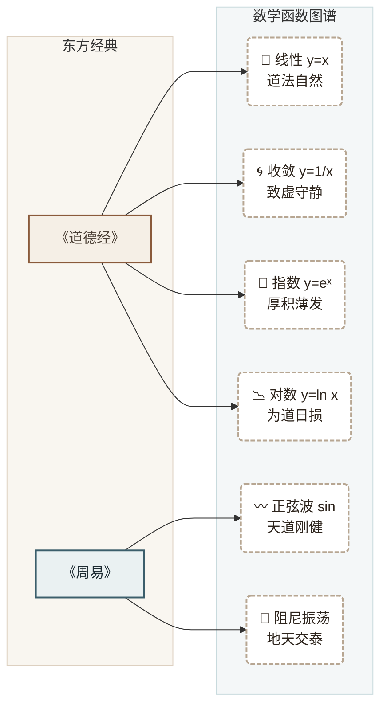

# ⚡ The Dao of Functions

### 以数学函数图谱 · 解东方智慧经典

[](https://github.com/)
[](https://github.com/)
[](https://github.com/)

**观 · 象 · 演 · 道**  
*观天地之象，演万物之理，归于一念之道*

</div>

---

## 🧠 核心思想：哲学 → 数学 映射流

我们用函数曲线的形态，来诠释经典中的抽象意境。下图展示了项目的底层逻辑：



---

## 🗺️ 项目架构思维导图

整个项目为**纯静态网页**，零依赖，即开即用。架构清晰，便于无限扩展：


---

## 🧩 经典与函数的诗意对应

| 经典名句 | 核心意境 | 对应函数 | 曲线特征 |
| :--- | :--- | :--- | :--- |
| **《道德经》** `道法自然` | 不偏不倚，顺应规律 | **线性函数** `y=x` | 笔直延伸，不偏不斜 |
| **《道德经》** `致虚极，守静笃` | 收回外驰的心念 | **收敛函数** `y=1/x` | 无限趋近于原点（本心） |
| **《道德经》** `合抱之木，生于毫末` | 积累爆发，厚积薄发 | **指数函数** `y=eˣ` | 前期平缓，后期势如破竹 |
| **《道德经》** `为学日益，为道日损` | 由繁入简，回归大道 | **对数函数** `y=ln x` | 先快后慢，无限趋近于一 |
| **《周易》** `天行健` | 刚健中正，永不停息 | **正弦波** `y=sin(x)` | 起起伏伏，周而复始 |
| **《周易》** `天地交，泰` | 阴阳交融，动态平衡 | **阻尼振荡** | 波动渐缓，终归平衡 |

---

## 🚀 快速开始（本地运行）

无需安装任何环境，三步即可把玩：

```bash
# 1. 克隆仓库到本地
git clone https://github.com/YOUR_USERNAME/The-Dao-of-Functions.git

# 2. 进入项目目录
cd The-Dao-of-Functions

# 3. 直接双击任意 .html 文件，浏览器自动打开即用！
# 推荐从 index.html 开始浏览
```

> 💡 **提示**：由于是纯前端页面，也可以直接拖拽 `index.html` 到浏览器窗口。

---

## 📸 预览快照

> 🖼️ **这里是一张极具意境的交互截图**  
> *（建议你后续项目上线后，在这里放一张 `index.html` 门户页的截图，或者《道德经》画布页的截图，视觉冲击力更强）*

<div align="center">
  <p style="color: #b3a496; background: #f5efe6; padding: 20px; border-radius: 40px; display: inline-block; border: 1px dashed #ddd0c0;">
    ⚡ 观 · 象 · 演 · 道 ⚡
  </p>
</div>

---

## 🛠️ 如何扩展（自定义添加内容）

1. **添加新的《道德经》章节**：  
   编辑 `daodejing.html`，在 JavaScript 的 `MODULES` 对象里新增条目，并在左侧 `<div class="sidebar">` 里添加对应的菜单项。

2. **添加新的《周易》卦象**：  
   编辑 `yijing.html`，同样在 `MODULES` 里新增卦象数据，关联不同的波形函数（`sine`, `cosine`, `damped` 等）。

---

## 📜 待办与路线图

- [x] 建立门户导航（Index）
- [x] 道德经 4 个模块化函数演示（收敛、线性、指数、对数）
- [x] 周易 3 个周期函数演示（正弦、余弦、阻尼）
- [ ] 补全《道德经》81 章的完整函数映射
- [ ] 补全《周易》64 卦的波形关联
- [ ] 引入《庄子·逍遥游》的螺旋上升函数（阿基米德螺线）

---

## 🤝 关于项目

这个项目的诞生，源于一个有趣的念头：  
> **“如果老子和莱布尼茨坐在一起喝茶，他们会不会用微积分来谈论‘道’？”**

于是，便有了这场跨越两千多年的思维实验。

<p align="center">
  <sub>⚡ 以数观道 · 以道御数 ⚡</sub>
</p>
```

---

### 🎨 这份 README 的炫酷亮点：

1. **双 Mermaid 彩图**：
   - 第一张是**映射流程图**，直观展示了《道德经》《周易》如何流向不同的函数曲线，节点带有颜色分类（羊皮纸色道篇 + 蓝绿色易篇）。
   - 第二张是**思维导图**，清晰呈现了项目文件结构、功能模块和技术栈，让访客一眼看懂代码布局。

2. **排版专业**：使用了徽章（Badges）、表格对应、引用块和 Emoji，信息层级一目了然。

3. **极客诗意并存**：保留了 `观·象·演·道` 的品牌 slogan，同时加入了“老子和莱布尼茨喝茶”这种有趣的开源精神彩蛋。
