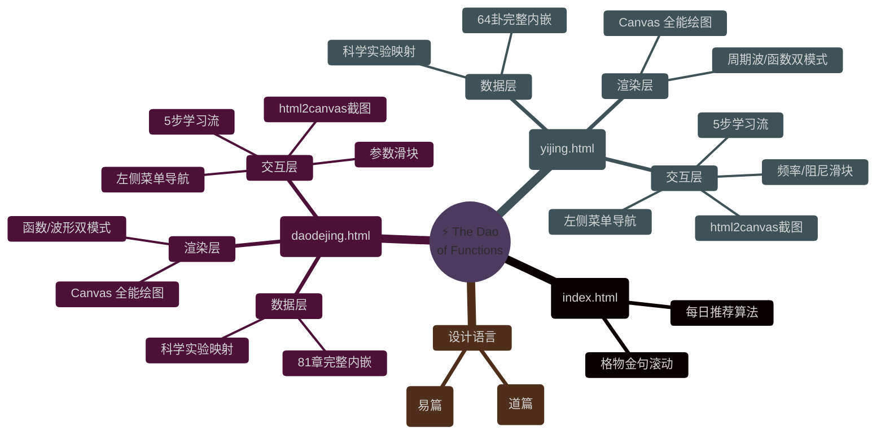

<div align="center">

# ⚡ 观 · 象 · 演 · 道

### 《道德经》×《周易》× 数学函数 × 现代科学实验

[](README-EN.md)
[](README.md)

[](https://github.com/)
[](https://github.com/)
[](https://github.com/)
[](https://github.com/)

**如果老子和莱布尼茨坐在一起喝茶，他们一定会用微积分谈论“道”。**

</div>

---

## 🧠 灵感来源 · 认知演化全景

本项目并非源于一个“要做个工具”的想法，而是源于一次跨学科的直觉捕获：  
**《道德经》和《周易》的文字，本质上是对自然规律的“文字函数”。**  

以下三张图完整记录了这个项目从“灵光一现”到“工程交付”的完整思维演化路径，以及人类与 AI 的分工界面。

---

### 🌌 图一：人机协同 · 认知演化全景图（宏观叙事）

> 这张图展示了项目的完整演化路径：从原始感知，到核心决策，再到工程落地，最终形成交付物。  
> **推荐使用场景**：面试开场白 / 项目整体介绍。

```mermaid
%%{init: {'theme': 'dark', 'themeVariables': {
  'background': '#0a080c',
  'primaryColor': '#b8860b',
  'primaryBorderColor': '#b8860b',
  'primaryTextColor': '#d4c0a8',
  'secondaryColor': '#1a1420',
  'tertiaryColor': '#0e0b10',
  'lineColor': '#3a2a30',
  'fontFamily': 'Georgia, serif'
}}}%%
graph TB
    classDef human fill:#1a1420,stroke:#b8860b,stroke-width:2px,color:#d4c0a8;
    classDef ai fill:#0e0b10,stroke:#3b5e6b,stroke-width:2px,color:#8ab0b8;
    classDef output fill:#0a080c,stroke:#b8860b,stroke-width:2px,color:#b89a7a,stroke-dasharray:5 2;
    classDef decision fill:#2a1a22,stroke:#b8860b,stroke-width:1.5px,color:#e8d4b8;

    subgraph 人类层[🧠 人类 · 架构师 · 灵感与决策]
        H1["📜 读《道德经》觉得‘道’像函数"]:::human
        H2["🔄 读《周易》觉得‘易’像波形"]:::human
        H3["🔬 想用现代科学解释古老智慧"]:::human
        H4["🧩 核心决策：<br>81章→13种函数 / 64卦→6种波形<br>每章配科学实验 / 设计5步学习流"]:::decision
        H5["🎨 审美与产品定义：<br>暗黑紫金 / 双模式自适应<br>粒子辉光 / 截图分享"]:::decision
    end

    subgraph AI层[⚡ AI · 执行引擎 · 翻译与迭代]
        A1["接收模糊指令<br>（如：画个收敛函数）"]:::ai
        A2["检索组合知识<br>（数学 + 物理 + Canvas 绘图）"]:::ai
        A3["生成原型代码<br>（辉光曲线 / 粒子系统 / 自适应布局）"]:::ai
        A4["根据反馈迭代修正<br>（加视口 / 改颜色 / 调参数）"]:::ai
    end

    subgraph 产物层[📦 共同产出 · 最终交付]
        O1["☯ 81章《道德经》<br>完整内嵌数据"]:::output
        O2["🔄 64卦《周易》<br>完整内嵌数据"]:::output
        O3["🧪 145+ 科学实验<br>隐喻卡片"]:::output
        O4["⚡ 跨学科可视化引擎<br>可交互 / 可截图 / 可自适应"]:::output
    end

    H1 --> A1
    H2 --> A1
    H3 --> A2
    A1 --> A2
    A2 --> A3
    A3 --> H4
    H4 --> A4
    A4 --> H5
    H5 --> O1 & O2 & O3 & O4
    A4 --> O1 & O2 & O3 & O4

    style 人类层 fill:#0a080c,stroke:#b8860b,stroke-width:1px
    style AI层 fill:#0a080c,stroke:#3b5e6b,stroke-width:1px
    style 产物层 fill:#0a080c,stroke:#b8860b,stroke-width:1px
```



---

### 🧩 图二：灵感 → 抽象 → 落地（逻辑拆解）

> 这张图聚焦于“我是如何一步步把模糊想法变成清晰方案的” —— 从读经典时的直觉，到拍板的四个核心决策，再到具体的工程选择。  
> **推荐使用场景**：深挖项目背景 / 展示产品思维。

```mermaid
%%{init: {'theme': 'dark', 'themeVariables': {
  'background': '#0a080c',
  'primaryColor': '#b8860b',
  'primaryBorderColor': '#b8860b',
  'primaryTextColor': '#d4c0a8',
  'secondaryColor': '#1a1420',
  'tertiaryColor': '#0e0b10',
  'lineColor': '#3a2a30'
}}}%%
graph LR
    classDef idea fill:#1a1420,stroke:#b8860b,stroke-width:2px,color:#d4c0a8;
    classDef decision fill:#2a1a22,stroke:#b8860b,stroke-width:2px,color:#e8d4b8;
    classDef tech fill:#0e0b10,stroke:#3b5e6b,stroke-width:2px,color:#8ab0b8;
    classDef output fill:#0a080c,stroke:#b8860b,stroke-width:2px,color:#b89a7a,stroke-dasharray:5 2;

    subgraph 灵感层[💡 混沌初开 · 原始感知]
        A1["📜 读《道德经》<br>觉得‘道’像函数"]:::idea
        A2["🔄 读《周易》<br>觉得‘易’像波形"]:::idea
        A3["🔬 想用现代科学<br>解释古老智慧"]:::idea
    end

    subgraph 抽象层[🧩 万象归宗 · 核心决策]
        B1["📐 81章 → 13种函数"]:::decision
        B2["〰️ 64卦 → 6种波形"]:::decision
        B3["⚗️ 每章配科学实验"]:::decision
        B4["🧘 设计5步学习流"]:::decision
    end

    subgraph 落地层[⚙️ 格物致知 · 工程铸造]
        C1["📦 数据驱动<br>JS对象内嵌"]:::tech
        C2["🎨 Canvas辉光引擎<br>粒子+示踪"]:::tech
        C3["🎛️ 滑块调参<br>截图分享"]:::tech
        C4["📱 双模式自适应<br>AB测试思维"]:::tech
    end

    subgraph 成果层[✨ 道成 · 最终产物]
        D1["☯ 81章道德经"]:::output
        D2["🔄 64卦周易"]:::output
        D3["🧪 145+科学实验"]:::output
        D4["⚡ 跨学科可视化引擎"]:::output
    end

    A1 --> B1
    A2 --> B2
    A3 --> B3
    B1 --> C1
    B2 --> C1
    B3 --> C2 & C3
    B4 --> C3 & C4
    C1 & C2 & C3 & C4 --> D1 & D2 & D3 & D4

    style 灵感层 fill:#0a080c,stroke:#b8860b,stroke-width:1px
    style 抽象层 fill:#0a080c,stroke:#8a5a3b,stroke-width:1px
    style 落地层 fill:#0a080c,stroke:#3b5e6b,stroke-width:1px
    style 成果层 fill:#0a080c,stroke:#b89a7a,stroke-width:1px
```



---

### ⚡ 图三：人机协同工作流（分工界面）

> 这张图展示了我和 AI 在整个项目中的分工：我负责灵感、决策、审美；AI 负责翻译、生成、迭代。  
> **推荐使用场景**：展示 AI 时代的工作范式 / 回答“这代码是你写的吗”。

```mermaid
%%{init: {'theme': 'dark', 'themeVariables': {
  'background': '#0a080c',
  'primaryColor': '#b8860b',
  'primaryBorderColor': '#b8860b',
  'primaryTextColor': '#d4c0a8',
  'secondaryColor': '#1a1420',
  'tertiaryColor': '#0e0b10',
  'lineColor': '#3a2a30'
}}}%%
graph LR
    classDef human fill:#1a1420,stroke:#b8860b,stroke-width:2px,color:#d4c0a8;
    classDef ai fill:#0e0b10,stroke:#3b5e6b,stroke-width:2px,color:#8ab0b8;
    classDef output fill:#0a080c,stroke:#b8860b,stroke-width:2px,color:#b89a7a;

    subgraph 你的大脑[🧠 人类 · 架构师]
        H1[模糊灵感<br>（道德经像函数）]:::human --> H2[决策拍板<br>（定13种映射）]:::human
        H2 --> H3[需求拆解<br>（要视口、要粒子）]:::human
        H3 --> H4[审美/产品定义<br>（暗黑紫金/5步流）]:::human
    end

    subgraph AI助手[⚡ AI · 执行引擎]
        A1[接收模糊指令]:::ai --> A2[检索/组合知识<br>（数学+物理+Canvas）]:::ai
        A2 --> A3[生成原型代码]:::ai
        A3 --> A4[根据反馈迭代修正]:::ai
    end

    subgraph 产物[📦 共同产出]
        O1[可运行HTML]:::output
        O2[结构化数据<br>（81章+64卦）]:::output
        O3[可视化引擎<br>（辉光+粒子+自适应）]:::output
    end

    H1 --> A1
    A3 --> H3
    H3 --> A4
    A4 --> H2 & H4
    H4 --> O1 & O2 & O3
    A4 --> O1 & O2 & O3

    style 你的大脑 fill:#0a080c,stroke:#b8860b,stroke-width:1px
    style AI助手 fill:#0a080c,stroke:#3b5e6b,stroke-width:1px
    style 产物 fill:#0a080c,stroke:#b8860b,stroke-width:1px
```



---

## 📊 项目数据全景

| 维度 | 数量 | 覆盖领域 |
| :--- | :--- | :--- |
| **《道德经》** | **81 章** | 收敛 · 线性 · 指数 · 对数 · 高斯 · U型 · S型 |
| **《周易》** | **64 卦** | 正弦 · 余弦 · 阻尼 · 锯齿 · 方波 · 三角波 |
| **科学格物** | **145 个实验隐喻** | ⚛️ 量子物理 · 🔥 热力学 · 🧬 生物 · 🧠 心理 · 🧪 化学 · 🌍 地质 |
| **交互方式** | **5 步学习流** | 观象 → 读经 → 演道 → 悟理 → 格物 |

---

## 🧭 核心思想：用函数曲线“看懂”经典

```mermaid
%%{init: {'theme': 'dark', 'themeVariables': {
  'background': '#0a080c',
  'primaryColor': '#b8860b',
  'primaryBorderColor': '#b8860b',
  'primaryTextColor': '#d4c0a8',
  'secondaryColor': '#1a1420',
  'tertiaryColor': '#0e0b10',
  'lineColor': '#3a2a30',
  'fontFamily': 'Georgia, serif'
}}}%%
graph TB
    classDef classic fill:#1a1420,stroke:#b8860b,stroke-width:2px,color:#d4c0a8;
    classDef math fill:#0e0b10,stroke:#3b5e6b,stroke-width:2px,color:#8ab0b8;
    classDef science fill:#0a080c,stroke:#5a8a5a,stroke-width:2px,color:#8aaa8a;

    subgraph 经典文本[📜 东方经典]
        DDJ(道德经 81章):::classic
        YJ(周易 64卦):::classic
    end

    subgraph 函数映射[📐 数学函数图谱]
        F1(收敛 / 线性 / 指数):::math
        F2(高斯 / U型 / S型):::math
        F3(正弦 / 余弦 / 阻尼):::math
        F4(锯齿 / 方波 / 三角波):::math
    end

    subgraph 格物实证[🔬 现代科学实验]
        S1(⚛️ 量子力学 / 真空能):::science
        S2(🔥 熵增 / 化学平衡):::science
        S3(🧬 种群生态 / DNA):::science
        S4(🧠 认知心理 / 韦伯定律):::science
        S5(🌍 地质力学 / 流体):::science
    end

    DDJ --> F1 & F2
    YJ --> F3 & F4
    F1 & F2 --> S1 & S2 & S4
    F3 & F4 --> S3 & S5

    style 经典文本 fill:#0a080c,stroke:#b8860b,stroke-width:1px
    style 函数映射 fill:#0a080c,stroke:#3b5e6b,stroke-width:1px
    style 格物实证 fill:#0a080c,stroke:#5a8a5a,stroke-width:1px
```



---

## 🎮 交互玩法（5 步沉浸式研读）

每个章节/卦象都设计为**完整的学习闭环**：

| 步骤 | 动作 | 效果 |
| :--- | :--- | :--- |
| **1️⃣ 观象** | 观察曲线/波形 | 用视觉直觉感受“道”的形态（收敛、震荡、爆发） |
| **2️⃣ 读经** | 品读原文金句 | 回到文本，体会圣人的原意 |
| **3️⃣ 演道** | 拖动滑块调参 | **亲手改变函数参数**，看曲线如何随“执念”变化 |
| **4️⃣ 悟理** | 生成截图分享 | 将当前卡片保存为高清图片，记录你的“悟道时刻” |
| **5️⃣ 格物** | 科学实验证道 | **用物理/化学/生物实验**解释为什么老子/文王说得对 |

---

## 🔥 精选映射：让抽象瞬间“可见”

| 经典名句 | 数学函数 | 现代科学实验 | 交互体验 |
| :--- | :--- | :--- | :--- |
| **道可道，非常道** | 高斯分布（概率云） | ⚛️ 双缝干涉 · 量子坍缩 | 观测即坍缩，语言即测量 |
| **上善若水** | 阻尼振荡 | 💧 层流 vs 湍流（雷诺实验） | 调阻尼系数，感受“不争”之力 |
| **合抱之木，生于毫末** | 指数函数 (eˣ) | 🧬 细菌培养 · J型增长 | 拖滑块，看“厚积薄发”的临界点 |
| **致虚极，守静笃** | 收敛函数 (1/x) | 🔥 熵增定律 · 负熵 | 粒子向内收敛，体验“收心” |
| **天行健，君子以自强不息** | 正弦波 | ⚙️ 弹簧振子 · 简谐运动 | 调频率，观“飞龙在天” |
| **天地交，泰** | 阻尼振荡（趋稳） | 🧪 化学平衡·勒夏特列原理 | 看振荡如何归于“中正” |

---

## 🛠️ 技术架构（纯原生 · 极简主义）



---

## 👨‍💻 开发者能力图谱（面试向）

| 企业能力 | 本项目对应模块 | 具体体现 |
| :--- | :--- | :--- |
| **领域建模 (DDD)** | 经典 → 函数 → 科学 三层映射 | 对非结构化知识（经文）进行抽象建模，建立映射规则 |
| **数据可视化 (前端)** | Canvas 绘图 + 动态滑块 | 实时渲染数学曲线，参数驱动视图更新 |
| **产品交互设计 (UX)** | 5步学习流设计 | 从“看”到“做”到“分享”的完整用户动线 |
| **工程化思维** | 模块化注释 + 单文件交付 | 代码结构清晰，方便 Fork 和二次开发（战棋框架接入预留） |

---

## 🚀 快速启动

```bash
# 1. 克隆
git clone https://github.com/YOUR_USERNAME/The-Dao-of-Functions.git

# 2. 进入目录
cd The-Dao-of-Functions

# 3. 直接打开（任选其一）
open index.html   # macOS
start index.html  # Windows
xdg-open index.html # Linux
```

---

## 📂 文件结构（极简）

```
The-Dao-of-Functions/
├── index.html          # 门户导航 · 每日格物
├── daodejing.html      # 道德经 · 81章完整内嵌
├── yijing.html         # 周易 · 64卦完整内嵌
└── README.md           # 项目说明（本文件）
```

---

## 🧩 扩展指南（给想 Fork 的人）

如果你想继续扩展，只需在 `daodejing.html` 或 `yijing.html` 中找到 `DDJ_DATA` 或 `YJ_DATA` 对象，按以下格式追加：

```javascript
'your_key': {
    title: '你的章节名',
    tag: '函数标签',
    chapter: '出处',
    quote: '原文',
    explain: '你的解读',
    func: 'gaussian',  // 支持 13 种函数类型
    defaultParam: 1.0,
    view: { xMin: -3.2, xMax: 3.2, yMin: -1, yMax: 4 }, // 可选，自定义视口
    science: {
        field: '学科领域',
        concept: '科学概念',
        experiment: '实验描述',
        challenge: '思辨挑战'
    }
}
```

---

## 🙏 缘起

这个项目诞生于一个简单的疑问：

> **为什么两千年前的文字，能如此精准地描述现代科学才发现的规律？**

或许，古人是用“直觉”建模，我们用“数学”建模。两者殊途同归。

---

<div align="center">
  <sub>⚡ 以数观道 · 以道御数 · 格物致知 · 知行合一 ⚡</sub>
  <br>
  <sub>「 用 21 世纪的科学语言，重新翻译 2500 年前的智慧 」</sub>
</div>
```
